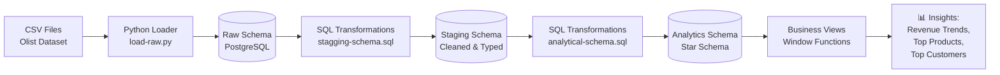
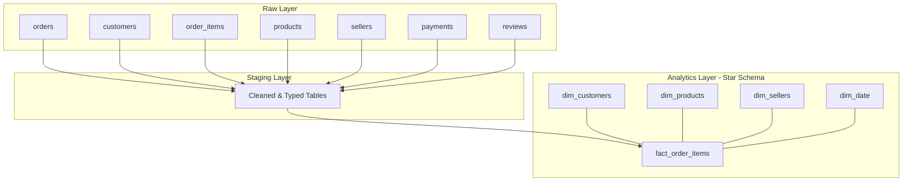
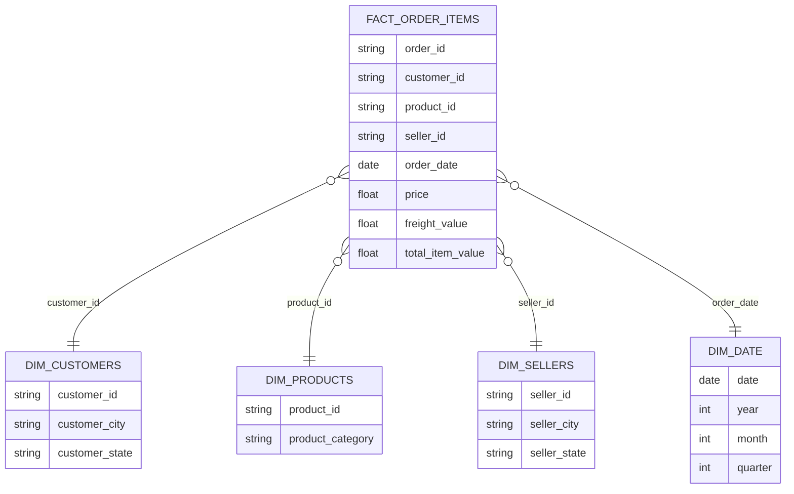

# 🛒 E-Commerce Data Pipeline

An end-to-end data engineering pipeline built on the Olist Brazilian E-Commerce dataset — demonstrating raw ingestion, staging transformations, a star-schema analytics layer, automated data quality testing, and CI/CD.


---

## 📌 Overview

This project simulates a real-world data engineering workflow: ingesting raw e-commerce data, cleaning and transforming it through a layered architecture, and modeling it into a star schema optimized for analytics — all validated by automated tests and CI.

**Dataset:** [Brazilian E-Commerce Public Dataset by Olist](https://www.kaggle.com/datasets/olistbr/brazilian-ecommerce) — 100k+ real orders (2016–2018)

---

## 🏗️ Architecture



### Layered Data Flow



---

## ⭐ Star Schema Design



---

## 🛠️ Tech Stack

| Layer | Tool |
|---|---|
| Language | Python 3.11 |
| Database | PostgreSQL 16 |
| Data Loading | Pandas + SQLAlchemy |
| Transformations | Pure SQL (CTEs, Window Functions) |
| Testing | Python (custom data quality checks) |
| CI/CD | GitHub Actions |
| Version Control | Git + GitHub |

---

## 📁 Project Structure

```
ecommerce-pipeline/
├── .github/workflows/
│   └── pipeline.yml          # CI pipeline definition
├── data/
│   ├── raw/                  # Full dataset (gitignored, local only)
│   └── sample/                # Small sample for CI testing
├── scripts/
│   ├── load-raw.py           # Extract: CSV → Raw schema
│   └── sample_data.py        # Generates CI sample data
├── sql/
│   ├── raw-schema.sql        # Raw schema definition
│   ├── stagging-schema.sql   # Cleaning & transformation logic
│   └── analytical-schema.sql # Star schema + analytical views
├── tests/
│   └── data-quality.py       # Automated data quality checks
├── requirements.txt
└── README.md
```

---

## 🚀 How to Run Locally

### 1. Clone the repo
```bash
git clone https://github.com/DSFAHAD/ecommerce-pipeline.git
cd ecommerce-pipeline
```

### 2. Set up virtual environment
```bash
python -m venv venv
venv\Scripts\activate        # Windows
source venv/bin/activate     # Mac/Linux
pip install -r requirements.txt
```

### 3. Set up PostgreSQL
```sql
CREATE DATABASE ecommerce_pipeline;
```

### 4. Configure environment variables
Create a `.env` file:
```
DB_HOST=localhost
DB_PORT=5432
DB_NAME=ecommerce_pipeline
DB_USER=postgres
DB_PASSWORD=your_password
```

### 5. Download the dataset
Get the [Olist dataset](https://www.kaggle.com/datasets/olistbr/brazilian-ecommerce) and place the CSVs in `data/raw/`

### 6. Run the pipeline
```bash
python scripts/load-raw.py data/raw
```
Then run the SQL files in pgAdmin (or via psql) in order:
1. `sql/raw-schema.sql`
2. `sql/stagging-schema.sql`
3. `sql/analytical-schema.sql`

### 7. Run data quality tests
```bash
python tests/data-quality.py
```

---

## 📊 Sample Insights

**Monthly Revenue Growth (2016–2018)**
Revenue scaled from a few hundred dollars in late 2016 to over $1M/month by 2018 — tracked via a `SUM() OVER()` running total window function.

**Top Products by Category**
Ranked using `RANK() OVER (PARTITION BY category ORDER BY revenue DESC)` to identify best-sellers within each product category.

**Top Customers by Spend**
Identified highest-value customers using aggregate + window functions for potential loyalty/retention targeting.

---

## ✅ CI/CD Pipeline

Every push triggers an automated GitHub Actions workflow that:
1. Spins up a fresh PostgreSQL instance
2. Loads sample data
3. Runs all SQL transformations (raw → staging → analytics)
4. Executes automated data quality checks

This ensures the pipeline logic is always verified — not just "works on my machine."

---

## 🔮 Future Improvements

- [ ] Add Apache Airflow for orchestration
- [ ] Containerize with Docker
- [ ] Add dbt for transformation management
- [ ] Build a BI dashboard (Metabase/Streamlit) on top of analytics views
- [ ] Add incremental loading instead of full refresh

---

## 👤 Author

**Fahad**
Computer Science Undergraduate | Aspiring Data Engineer
GitHub: [@DSFAHAD](https://github.com/DSFAHAD)

---

## 📄 License

This project is licensed under the MIT License.
